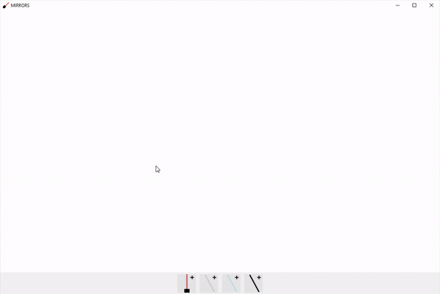

# Mirrors
"Mirrors" is a Windows desktop application that shows how light bounces off of mirrors and windows. Created with C++.

## How to use
To run this program, download the .exe and run it. Press C to delete all current laser pointers and mirrors.
